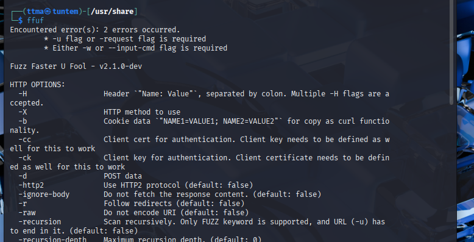
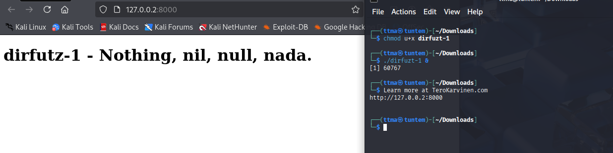

# h4 Fuzzy
Kotitehtävä h4 Fuzzy Tero Karvisen Tunkeutumistestaus 2025 syksy -kurssille. [Linkki kurssisivulle](https://terokarvinen.com/tunkeutumistestaus/)
Jokaisessa kohdassa on alla olevalla "quote" tyylillä kerrottu tehtävänanto.
>Liirum laarum laa...
## Tehtävät
### x)
> Lue/katso/kuuntele ja tiivistä. (Tässä x-alakohdassa ei tarvitse tehdä testejä tietokoneella, vain lukeminen tai kuunteleminen ja tiivistelmä riittää. Tiivistämiseen riittää muutama ranskalainen viiva. Lisää mukaan jokin oma idea, huomio, kysymys tai kommentti
> * Karvinen 2023: [Find Hidden Web Directories - Fuzz URLs with ffuf](https://terokarvinen.com/2023/fuzz-urls-find-hidden-directories/)
> * Jompi kumpi, Hoikkalan video tai teksti:
>   * Hoikkala 2023: ffuf README.md, tai
>   * Hoikkala "joohoi" 2020: [Still Fuzzing Faster (U fool).](https://www.youtube.com/watch?v=mbmsT3AhwWU) In HelSec Virtual meetup #1. (Noin tunnin mittainen)

#### Hoikkalan video
 
* Erittäin kattava demovideo ffuf:sta. 
* Ffuffia voidaan käyttää erittäin laajasti.
* Hieno nähdä että noinkin ammattilaisella demo voi mennä rikki kesken demon :D.

#### Teron artikkeli

* Hyvä tiivis pikaohje ffuffiin. Veikkaan että tämän avulla pääsee hyvin alkuun kotitehtävissä

### a) 
> a) Fuzzzz. Ratkaise dirfuz-1 artikkelista Karvinen 2023: [Find Hidden Web Directories - Fuzz URLs with ffuf.](https://terokarvinen.com/2023/fuzz-urls-find-hidden-directories/)

Testasin heti ensimmäisenä, että löytyykö ffuf kalista `fuff` ja sehän löytyi.

Seuraavaksi katsoin löytyykö Seclistiä kalistani, ei löytynyt joten latasin koko Seclistin `sudo apt install seclists` komennolla. Tämän jälkeen asensin [dirfuzt-1](https://terokarvinen.com/2023/fuzz-urls-find-hidden-directories/dirfuzt-1) maalin.

Ennen kuin lähdin testaamaan fuzzausta, niin otin nettiadapterin pois käytöstä suoraan Virtualboxista. Tämän jälkee pingasin vielä `ping 8.8.8.8`, jotta varmistun että kone ei ole yhdistetty nettiin.

Sitten muutin dirfuzt-1 maalin oikeudet niin, että sen pystyy suorittamaa. Tämän jälkeen laitoin sen päälle ja katsoin nettiselaimesta että sivu toimii. Laitoin `&` komennon jälkeen, jotta pystyn jatkamaan samassa terminaalissa.

    chmod +ux dirfuzt-1
    ./dirfuzt-1 &

Kopion vielä common.txt wordlistin Downloads folderiin, jotta ei aina tarvitse pitkää filepathia

    cp /usr/share/seclists/Discovery/Web-Content/common.txt /home/ttma/Downloads/ 

#### Ffuffin käytön aloittaminen
Katsoin vielä tehtävanantoa ja siellä oli seuraava "vinkki".
> Can you find two URLs:
Admin page
Version control related page

# Lähteet
https://www.kali.org/tools/seclists/