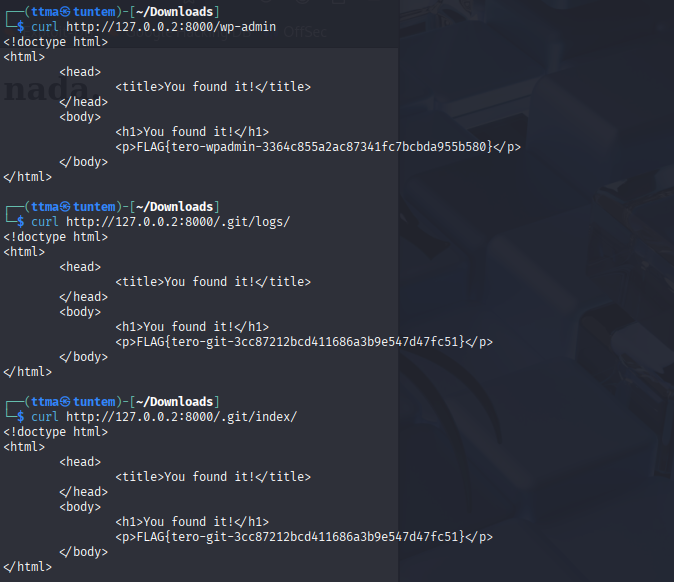
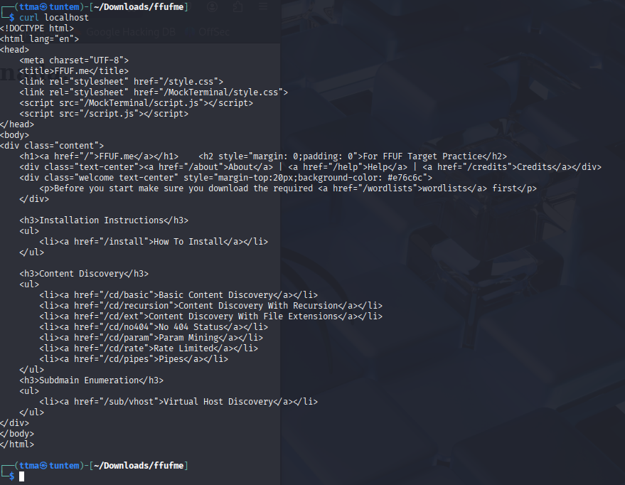
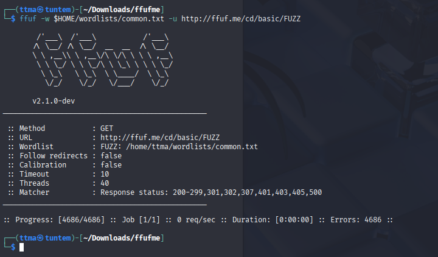
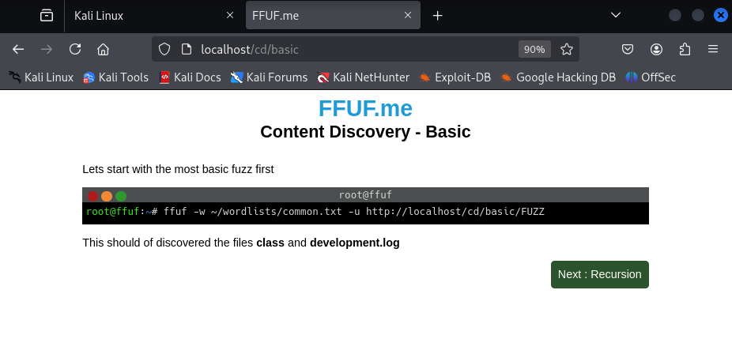
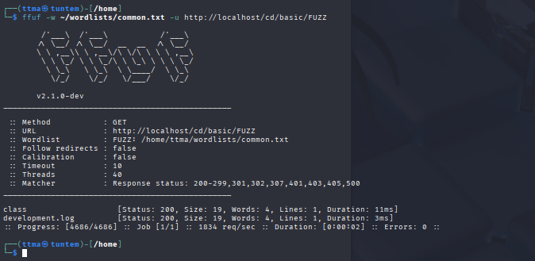

# h4 Fuzzy
Kotitehtävä h4 Fuzzy Tero Karvisen Tunkeutumistestaus 2025 syksy -kurssille. [Linkki kurssisivulle](https://terokarvinen.com/tunkeutumistestaus/)
Jokaisessa kohdassa on alla olevalla "quote" tyylillä kerrottu tehtävänanto.
>Liirum laarum laa...
## Tehtävät
### x)
> Lue/katso/kuuntele ja tiivistä. (Tässä x-alakohdassa ei tarvitse tehdä testejä tietokoneella, vain lukeminen tai kuunteleminen ja tiivistelmä riittää. Tiivistämiseen riittää muutama ranskalainen viiva. Lisää mukaan jokin oma idea, huomio, kysymys tai kommentti
> * Karvinen 2023: [Find Hidden Web Directories - Fuzz URLs with ffuf](https://terokarvinen.com/2023/fuzz-urls-find-hidden-directories/)
> * Jompi kumpi, Hoikkalan video tai teksti:
>   * Hoikkala 2023: ffuf README.md, tai
>   * Hoikkala "joohoi" 2020: [Still Fuzzing Faster (U fool).](https://www.youtube.com/watch?v=mbmsT3AhwWU) In HelSec Virtual meetup #1. (Noin tunnin mittainen)

#### Hoikkalan video
 
* Erittäin kattava demovideo ffuf:sta. 
* Ffuffia voidaan käyttää erittäin laajasti.
* Hieno nähdä että noinkin ammattilaisella demo voi mennä rikki kesken demon :D.

#### Teron artikkeli

* Hyvä tiivis pikaohje ffuffiin. Veikkaan että tämän avulla pääsee hyvin alkuun kotitehtävissä

### a) 
> a) Fuzzzz. Ratkaise dirfuz-1 artikkelista Karvinen 2023: [Find Hidden Web Directories - Fuzz URLs with ffuf.](https://terokarvinen.com/2023/fuzz-urls-find-hidden-directories/)

Testasin heti ensimmäisenä, että löytyykö ffuf kalista `fuff` ja sehän löytyi.

Seuraavaksi katsoin löytyykö Seclistiä kalistani, ei löytynyt joten latasin koko Seclistin `sudo apt install seclists` komennolla. Tämän jälkeen asensin [dirfuzt-1](https://terokarvinen.com/2023/fuzz-urls-find-hidden-directories/dirfuzt-1) maalin.

Ennen kuin lähdin testaamaan fuzzausta, niin otin nettiadapterin pois käytöstä suoraan Virtualboxista. Tämän jälkee pingasin vielä `ping 8.8.8.8`, jotta varmistun että kone ei ole yhdistetty nettiin.

Sitten muutin dirfuzt-1 maalin oikeudet niin, että sen pystyy suorittamaa. Tämän jälkeen laitoin sen päälle ja katsoin nettiselaimesta että sivu toimii. Laitoin `&` komennon jälkeen, jotta pystyn jatkamaan samassa terminaalissa.

    chmod +ux dirfuzt-1
    ./dirfuzt-1 &

Kopion vielä common.txt wordlistin Downloads folderiin, jotta ei aina tarvitse pitkää filepathia

    cp /usr/share/seclists/Discovery/Web-Content/common.txt /home/ttma/Downloads/ 

#### Ffuffin käytön aloittaminen
Katsoin vielä tehtävanantoa ja siellä oli seuraava "vinkki".
> Can you find two URLs:
Admin page
Version control related page

Eli tarkoituksena on löytää `http://127.0.0.2:8000/FUZZ`, jossa FUZZ on siis muuttuja, jonka löytämiseen käytämme hyväksi wordlistia. Testasinkin seuraavaksi fuzzata ihan normaalisti

    http://127.0.0.2:8000/FUZZ

Ja vastaus oli odotettu, kaikkiin vaihtoehtoihin tuli "Status 200". Tämä tarkoittaa sitä, että seuraavaksi kun lähden filtteröimään vastauksia, en voi käyttää pelkästään statuskoodia filtteröinissä. Melkein jokaisen vastauksen koko oli 154, sanoja 9 ja rivejä 10. Lähdinkin seuraavaksi filtteröimään koon mukaan "`-fs `  filter by size".

    ┌──(ttma㉿tuntem)-[~/Downloads]
    └─$ ffuf -w common.txt -u http://127.0.0.2:8000/FUZZ -fs 154 -v

            /'___\  /'___\           /'___\       
        /\ \__/ /\ \__/  __  __  /\ \__/       
        \ \ ,__\\ \ ,__\/\ \/\ \ \ \ ,__\      
            \ \ \_/ \ \ \_/\ \ \_\ \ \ \ \_/      
            \ \_\   \ \_\  \ \____/  \ \_\       
            \/_/    \/_/   \/___/    \/_/       

        v2.1.0-dev
    ________________________________________________

    :: Method           : GET
    :: URL              : http://127.0.0.2:8000/FUZZ
    :: Wordlist         : FUZZ: /home/ttma/Downloads/common.txt
    :: Follow redirects : false
    :: Calibration      : false
    :: Timeout          : 10
    :: Threads          : 40
    :: Matcher          : Response status: 200-299,301,302,307,401,403,405,500
    :: Filter           : Response size: 154
    ________________________________________________

    [Status: 200, Size: 178, Words: 6, Lines: 11, Duration: 20ms]
    | URL | http://127.0.0.2:8000/.git/logs/
        * FUZZ: .git/logs/

    [Status: 200, Size: 178, Words: 6, Lines: 11, Duration: 2ms]
    | URL | http://127.0.0.2:8000/.git/index
        * FUZZ: .git/index

    [Status: 200, Size: 178, Words: 6, Lines: 11, Duration: 0ms]
    | URL | http://127.0.0.2:8000/.git/config
        * FUZZ: .git/config

    [Status: 200, Size: 178, Words: 6, Lines: 11, Duration: 0ms]
    | URL | http://127.0.0.2:8000/.git/HEAD
        * FUZZ: .git/HEAD

    [Status: 301, Size: 41, Words: 3, Lines: 3, Duration: 1ms]
    | URL | http://127.0.0.2:8000/.git
    | --> | /.git/
        * FUZZ: .git

    [Status: 301, Size: 64, Words: 3, Lines: 3, Duration: 0ms]
    | URL | http://127.0.0.2:8000/render/https://www.google.com
    | --> | /render/https:/www.google.com
        * FUZZ: render/https://www.google.com

    [Status: 200, Size: 182, Words: 6, Lines: 11, Duration: 3ms]
    | URL | http://127.0.0.2:8000/wp-admin
        * FUZZ: wp-admin

    :: Progress: [4746/4746] :: Job [1/1] :: 0 req/sec :: Duration: [0:00:00] :: Errors: 0 ::
                                                                                                    
    ┌──(ttma㉿tuntem)-[~/Downloads]
    └─$ 

No sehän toimi! Selkeästi alihakemistot ``"wp-admin" ja ".git/logs &config &head "`` vaikuttavat oikeilta alihakemistoilta, joista voisi löytyä jotain liittyen versionhallintaan sekä ylläpitösivuun. 

Varmasti löytyy jokin parempikin tapa curlata monta osoitetta samaan aikaan. Mutta nyt curlattavia osoitteita oli sen verran vähän, joten curlasin ne manuaalisesti yksitellen.

Kaikista `.git` alihakemistoista löytyi flagi, sekä myös `wp-admin` alihakemistosta.

### b)
> Fuff me. Asenna FuffMe-harjoitusmaali. Karvinen 2023: [Fuffme - Install Web Fuzzing Target on Debian](https://terokarvinen.com/2023/fuffme-web-fuzzing-target-debian)

Seuraavaksi lähdin asentamaan Fuffme-harjoitusmaalia. Ennen tätä, suljin dirtfuzt-1 `kill %1` ja laitoin virtuaalikaapelin takaisin kaliin, jotta voin ottaa yhteyden internettiin. 

Seurasin annettua ohjetta asennukseen,

    sudo apt-get install docker.io git ffuf
    git clone https://github.com/adamtlangley/ffufme
    cd ffufme
    sudo docker build -t ffufme .
    curl localhost

Tämän jälkeen latasin vielä tarvittavat wordlistit

    mkdir $HOME/wordlists
    cd $HOME/wordlists
    wget http://ffuf.me/wordlist/common.txt
    wget http://ffuf.me/wordlist/parameters.txt 
    wget http://ffuf.me/wordlist/subdomains.txt    

Seuraavaksi otin Kalin pois netistä, testasin ettei se saa yhteyttä nettiin. Kone ei saanut yhteyttä nettiin, joten testasin fuzzausta juuri asennettuun kohteeseen.

    ffuf -w $HOME/wordlists/common.txt -u http://ffuf.me/cd/basic/FUZZ

Tuli errori. Katsoin localhostin Content Discovery Basic kohtaa, jossa sama komento annettiinkin 

    ffuf -w ~/wordlists/common.txt -u http://localhost/cd/basic/FUZZ

Testasin tätä ja löysin onnistuneesti class ja development.log alihakemistot.

Eroa näissä komennoissa on se, että ohjeissa fuzzaus menee `ffuf.me` eikä ``localhost``. Tässä tuli taas hyvä muistutus itselle, että ei kannata olla copy paste soturi vaan myös katsoa mitä komentoja suorittaa koneella.

### c) Basic Content Discovery
Äskeisen kohdan loppu oli C kohta.

### d) Content Discovery With Recursion

# Lähteet
https://www.kali.org/tools/seclists/
https://terokarvinen.com/tunkeutumistestaus/
https://github.com/ffuf/ffuf
https://terokarvinen.com/2023/fuffme-web-fuzzing-target-debian/