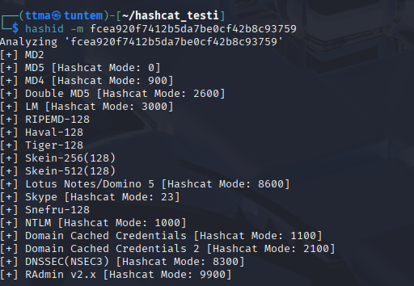

# h4 Fuzzy
Kotitehtävä h4 Syyskuu2025! Tero Karvisen Tunkeutumistestaus 2025 syksy -kurssille. [Linkki kurssisivulle](https://terokarvinen.com/tunkeutumistestaus/)
Jokaisessa kohdassa on alla olevalla "quote" tyylillä kerrottu tehtävänanto.
>Liirum laarum laa...

## Tehtävät
### x)
>Lue/katso ja tiivistä. (Tässä x-alakohdassa ei tarvitse tehdä testejä tietokoneella, vain lukeminen tai kuunteleminen ja tiivistelmä riittää. Tiivistämiseen riittää muutama ranskalainen viiva kustakin artikkelista. Kannattaa lisätä myös jokin oma ajatus, idea, huomio tai kysymys.)
Karvinen 2022: [Cracking Passwords with Hashcat](https://terokarvinen.com/2022/cracking-passwords-with-hashcat/)
Karvinen 2023: [Crack File Password With John](https://terokarvinen.com/2023/crack-file-password-with-john/)
€ Santos et al 2017: Security Penetration Testing - The Art of Hacking Series LiveLessons:[ Lesson 6: Hacking User Credentials](https://learning.oreilly.com/videos/security-penetration-testing/9780134833989/9780134833989-sptt_00_06_00_00) (8 videos, about 30 min)

#### Karvinen 2022: cracking Passwords with Hashcat
Hashcat TLDR
- Käytä jotain x hashia
    - esimerkiksi voit tehdä oman hashin helposti        

- ``hashid -m 5c661701b27d8d1a9b79880b9c7c4376`` (eli siis tähän hash jonka haluat murtaa)

- Valitse se millä tavalla luulet että kyseinen hash on tehty, esim MD5

            hashid -m 5c661701b27d8d1a9b79880b9c7c4376                           
            Analyzing '5c661701b27d8d1a9b79880b9c7c4376'
            [+] MD2 
            [+] MD5 [Hashcat Mode: 0]
            [+] MD4 [Hashcat Mode: 900]

- ``hashcat -m 0 '5c661701b27d8d1a9b79880b9c7c4376' rockyou.txt -o solved``. Hashcat yrittää murtaa halutun hashin valitulla tavalla. Tässä -m 0 kertoo että käytetään aiemmin päätettyä x hashia, esim nyt se on siis MD5. Sitten laitetaan hash mikä halutaan murtaa. Tämän jälkeen millä sanalistalla. Lopuksi nyt esimerkissä käytettiin `-o solved` joka siis tallentaa murretun salasanan solved nimiseen teidostoon. Tiedoston sisältö on mallia hash:hash_in_plainword

#### Karvinen 2023: Cracking File Password With John

Johnilla helppo murtaa esimerkiksi kansioiden salasanoja. 

Jos john asennettuna
    
    john
    cd .john
    zip2john tiedosto.zip > tiedosto.zip.hash
    john tero.zip.hash

#### Santos et al 2017: Security Penetration Testing - The Art of Hacking Series LiveLessons: Lesson 6: Hacking User Credentials (8 videos, about 30 min)

### a)
>  Asenna Hashcat ja testaa sen toiminta murtamalla esimerkkisalasana.

Minulla oli jo hashcat asennettuna, mutta sen pystyy helposti asentamaan ``sudo apt install hashcat``. Seuraavaksi tein uuden kansion jossa testin tiedostot pysyvät helposti samassa paikassa.

    ┌──(ttma㉿tuntem)-[~]
    └─$ mkdir hashcat_testi
                                                                                
    ┌──(ttma㉿tuntem)-[~]
    └─$ cd hashcat_testi 
        
Tämän jälkeen tein tiedoston, johon tallensin salasanan selkokielellä, jotta muistan oikean salasanan. Tämän jälkeen tein kyseisen sanan hashin.

Seuraavaksi tunnistin minkä tyyppinen hash on kyseessä

Mitä ylempänä listalla, sitä todennäköisemmin kyseinen hash on hashattu x tavalla. 

Nyt on aika murtaa salasana! Runasin seuraavan komennon ``hashcat -m 0 'fcea920f7412b5da7be0cf42b8c93759' /usr/share/wordlists/rockyou.txt
``. Kohdasta status näkee, että kyseinen salasana on murrettu. Hieman ylempänä näkyy myös hash ja murrettu salasana, `fcea920f7412b5da7be0cf42b8c93759:1234567 `. Saman voi myös printata consoleen helposti nyt jälkeenpäin runaamalla edellinen komento ``--show`` tagilla

