# H7 Maalisuoralla
Kotitehtävä h7 Maalisuoralla Tero Karvisen Tunkeutumistestaus 2025 syksy -kurssille. [Linkki kurssisivulle](https://terokarvinen.com/tunkeutumistestaus/)
Jokaisessa kohdassa on alla olevalla "quote" tyylillä kerrottu tehtävänanto.
>Liirum laarum laa...

## Tehtävät

### b)
> HTB Dancing. Ratkaise HackTheBox.com: [Starting Point:](https://app.hackthebox.com/starting-point) Tier 0: Dancing.

Aloitin tehtävän lataamalla VPN tiedoston, jotta pystyn yhdistämään kyseiseen koneeseen omalta virtuaalikoneeltani.

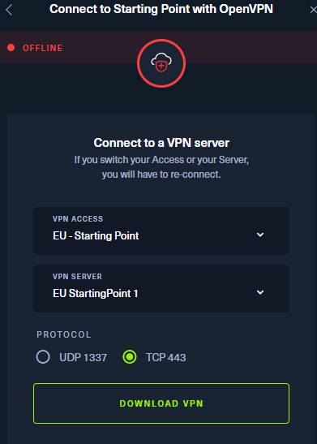

Ladattuani tiedoston siirsin sen virutaalikoneelleni, jonka jälkeen käytin komentoa `openvpn <tiedostonsijainti>`.

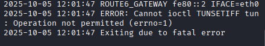

Tuli errori. Katsoin apua HTB:n forumilta ja kyseinen errori johtui siitä, että en suorittanut komentoa sudona, `sudo openvpn Desktop/testivpn.ovpn.`.

Käynnistin kohdekoneen HTB:ssa ja se antoi ip:n

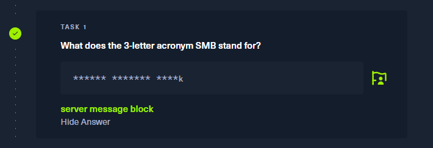

Pingasin ip:n, yhteys toimii ja sain yhteyden kohdekoneeseen. 

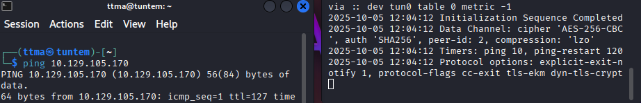

#### Task 1
>What does the 3-letter acronym SMB stand for?
server message block

#### Task 2
> What port does SMB use to operate at?
445

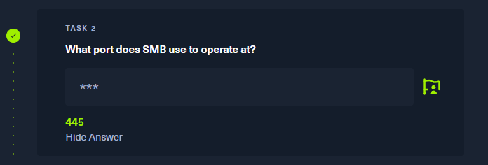

#### Task 3
> What is the service name for port 445 that came up in our Nmap scan?

Runasin nmap komennon `sudo nmap -A -T4 -p- 10.129.105.170 -oA htb
`. Komento skannaa kohdekoneen jokaisen portin ja tallentaa tiedot `htb.` tiedostoihin. 

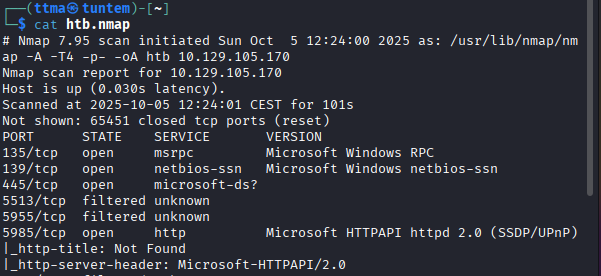

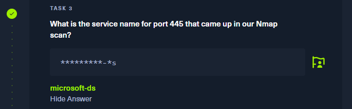

#### Task 4
> What is the 'flag' or 'switch' that we can use with the smbclient utility to 'list' the available shares on Dancing?

Katsoin apua `smbclient --help` komennon avulla. Vastaus oli aika itsestäänselvä, ``-L``. 

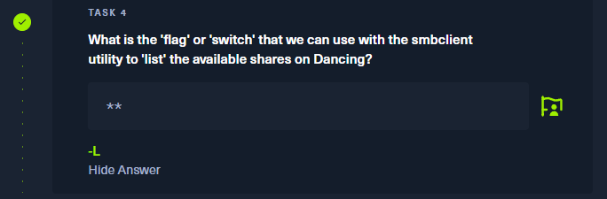

#### Task 5
> How many shares are there on Dancing?

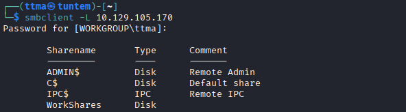

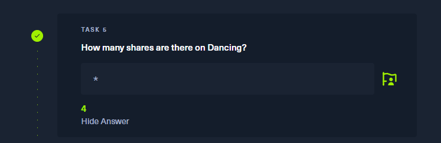

#### Task 6
>What is the name of the share we are able to access in the end with a blank password?

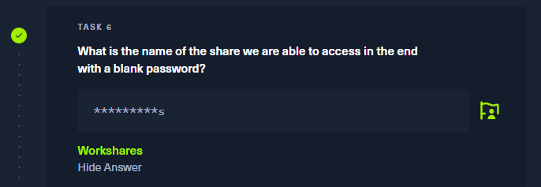

#### Task 7
> What is the command we can use within the SMB shell to download the files we find?

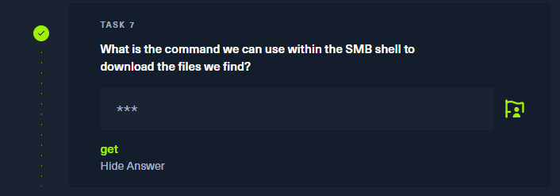

#### Task 8
> Submit root flag

Tässä kohtaa olin himean pihalla, että mistä tuo lippu pitäisi saada. Tulin kuitenkin päätelmään aikasemmista tehtävistä, että: yhdistä smb --> Workshares --> Lataa tiedostot.

Yritin uudestaan listata listata "sharet", mutta tuli tälläinen errori. Pingi kuitenkin toimi, mutta nmap ei löytänyt portteja.

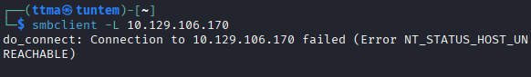

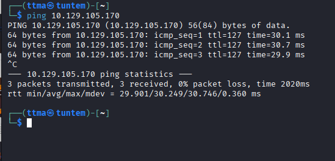

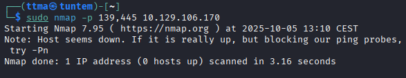

Resetoinkin kohdekoneen, jos se auttaisi ongelmaan

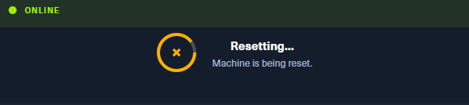

Resetoinni jälkeen taas toimi.

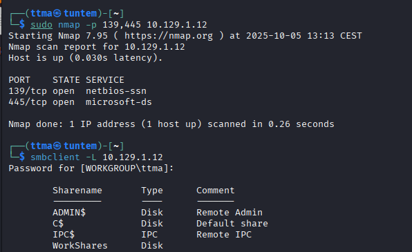

Seuraavaksi yhdistinkin haavoittuvaiseen Shareen "WorkShares", jossa ei ollut salasanaa. 

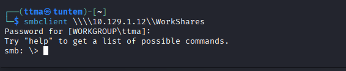

Lähdinkin tutkimaan konetta.

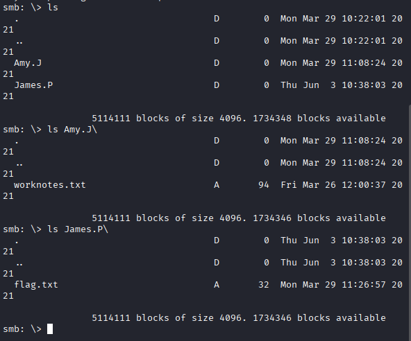

Lippu löytyi James.P/ kansiosta. Siirsin tiedoston omalle koneelleni, jonka jälkeen katsoin tiedoston sisälle.

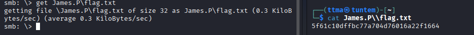

Sitten testasin flagia ja sain suoritettua Dancing koneen loppuun.

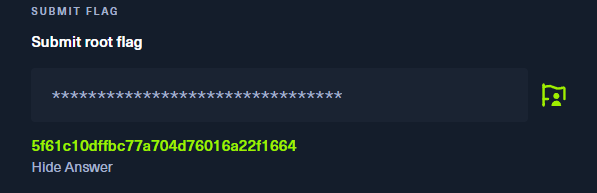

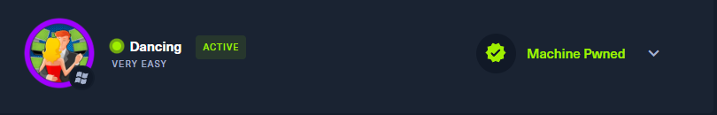

### c)
> HTB Responder. Ratkaise HackTheBox.com: [Starting Point](https://app.hackthebox.com/starting-point): Tier 1: Responder.

#### Task 1
> When visiting the web service using the IP address, what is the domain that we are being redirected to?

Kirjoitin koneen ip:n nettiselaimeen ja se uudelleenohjasi osoitteeseen unika.htb

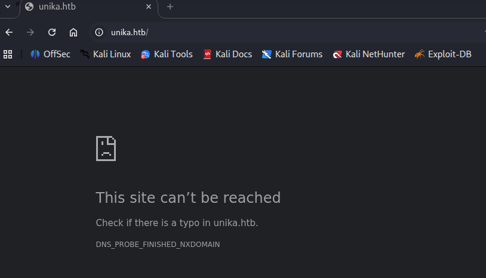

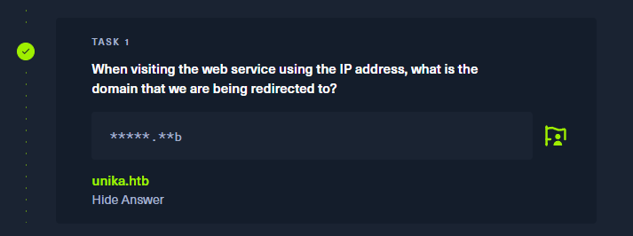

#### Task 2
> Which scripting language is being used on the server to generate webpages?

Curlasin sivuston ja siellä näkyi PHP, jota käytetään juuri esimerkiksi nettisivuilla back-end puolella.

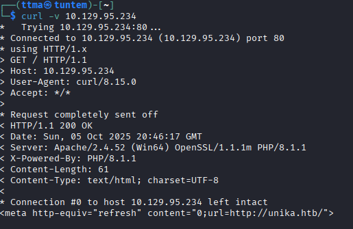

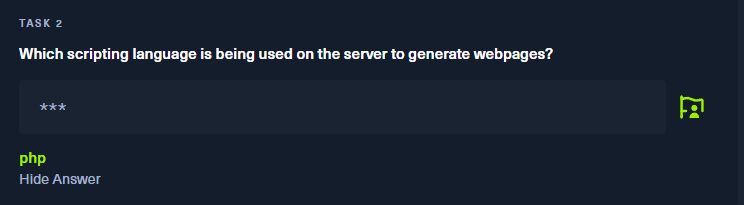

#### Task 3
> What is the name of the URL parameter which is used to load different language versions of the webpage?

Tässä kohtaa olin himean pihalla, joten päätin katsoa "Official Writeup" kyseisestä boksista. Ongelma on, että kyseinen kone on sellainen, jonka ip hostaa monta nettisivua, joten pelkkä ip:n laittaminen ei riitä. Tätä varten suoritin komennon `echo "10.129.95.234 unika.htb" | sudo tee -a /etc/hosts
`. Nyt sivusto näkyy ja saan jatkettua tehtävää.

Tehtävä oli etsiä url parametri, jolla ladataan eri kielet. Vaihdoinkin oikeasta yläkulmasta en --> fr (french) ja url muuttui. 

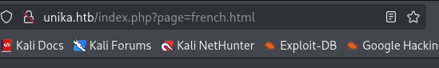

Vastaus on page

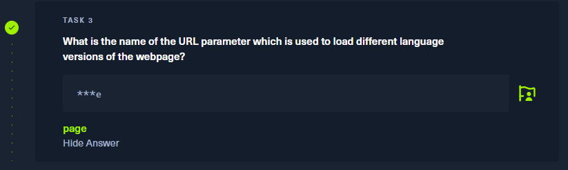

#### Task 4 
> Which of the following values for the `page` parameter would be an example of exploiting a Local File Include (LFI) vulnerability: "french.html", "//10.10.14.6/somefile", "../../../../../../../../windows/system32/drivers/etc/hosts", "minikatz.exe"

# Lähteet
https://help.hackthebox.com/en/articles/5185536-connection-troubleshooting